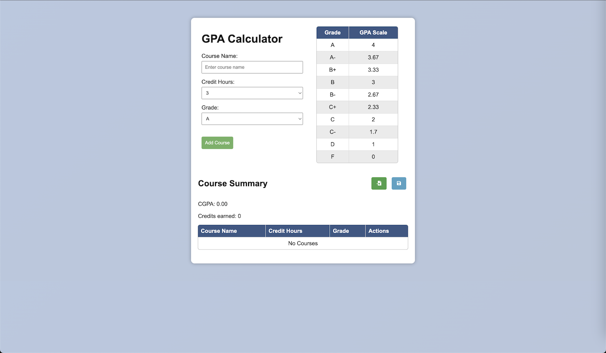
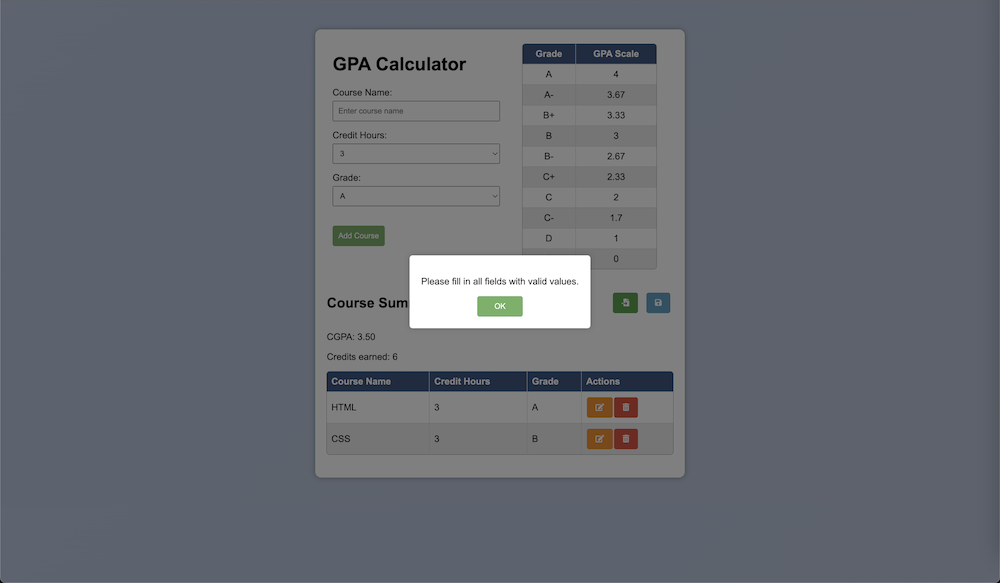
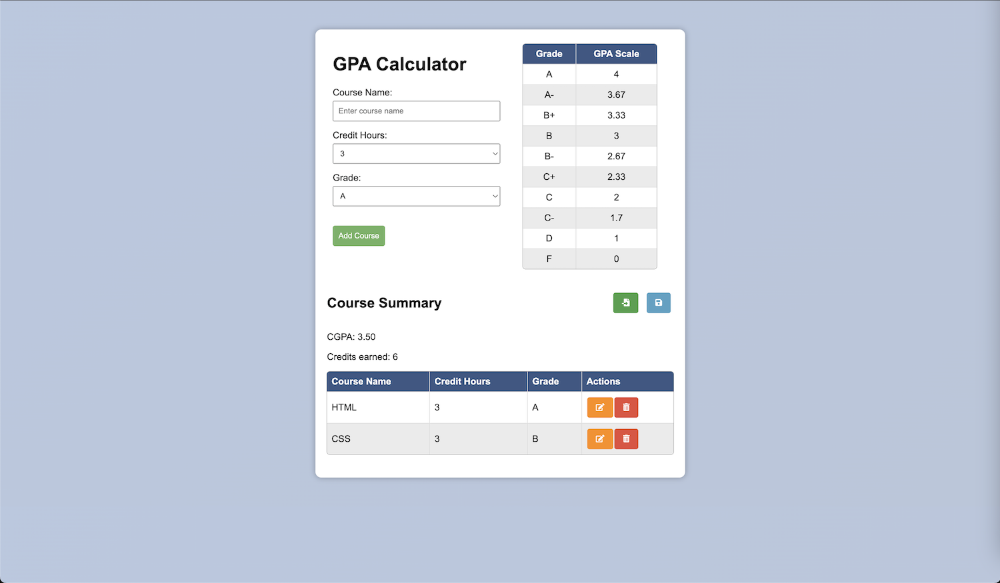
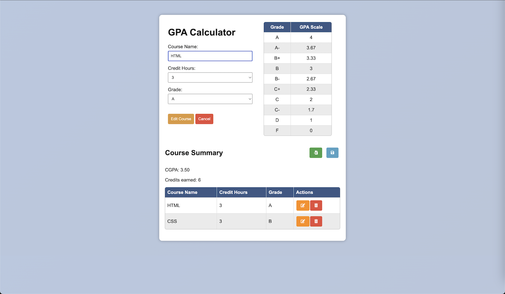
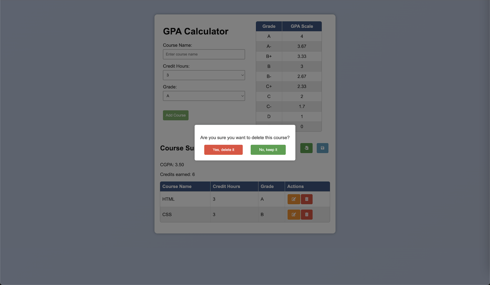
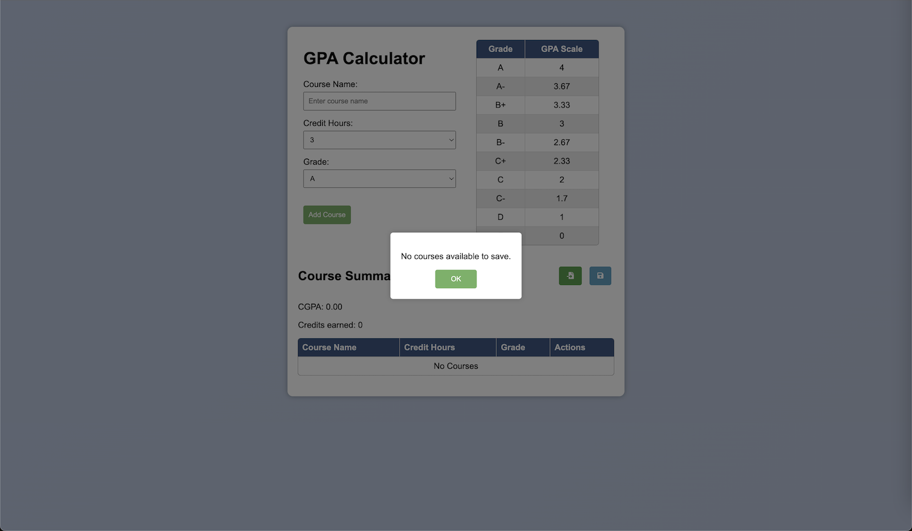

# GPA Calculator Web

A simple GPA (Grade Point Average) calculator implemented with HTML, CSS, and JavaScript. Calculate and manage your courses, credits, and GPA effortlessly.

## Features

- Add and manage multiple courses with credit hours and grades.
- Calculate cumulative GPA based on entered course details.
- Import and export your course data in JSON format.
- Responsive design for a seamless user experience.

## Usage

1. Clone the repository:

   ```bash
   git clone https://github.com/sothengski/GPA_Calculator_Web.git
   cd GPA_Calculator_Web

## File Structure
```plaintext
GPA_Calculator_Web/
│
├── index.html
├── styles.css
├── script.js
├── grade_scales.json
└── README.md
```

## Screenshots

GPA Calculator


Add the Course with the dialog Validation


List all the Courses


Edit the Course


Delete the Course withe the confirmation dialog


Save Courses data to Json file with the empty data alert dialog


## Example JSON Object:

```json
{
  "courses": [
    {
      "name": "HTML",
      "credit": 3,
      "grade": "A",
      "gpaValue": 4
    },
    {
      "name": "CSS",
      "credit": 3,
      "grade": "B",
      "gpaValue": 3
    }
  ],
  "cgpa": "3.50",
  "credits": 6
}
```
